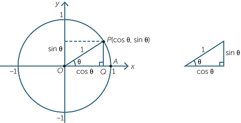

# Excersice of building an Asteroids demo game written in Vanilia JS and Canvas

**The game is inspired by the 1979 Atari classic, Asteroids game.**

- Game (UI) is written in HTML Canvas element.
- Communication (Server) is written in Python Socket.
- If it will be, the auth and login functionality will be written in FastAPI (Python).

## Rysowanie statku

Funkcja rysująca spaceship każdorazowo rysuje statek na płaszczyźnie współrzędnych z układem odniesienia w punkcie `(0, 0)` "xCoordinates, yCoordinates)".

Wszystkie kształty (proste, okręgi) rysowane są w odniesieniu do tego punktu, a promień (`radius`) definiuje rozmiar statku. Funkcja używa współrzędnych biegunowych oraz krzywych kwadratowych (`quadraticCurveTo`) do stworzenia kształtu spaceship'a.

Na podstawie powyższego środek statku znajduje się w punkcie `(0, 0)`, a przód statku jest na dodatniej osi x, w punkcie `(radius, 0)`.

`curve` to współczynnik, który kontroluje, jak bardzo tył statku będzie wygięty. Jest to wartość w zakresie od 0 do 1.

Gdy `curve` wynosi 1, punkt kontrolny krzywej znajdzie się dokładnie w pozycji `(0, 0)` (na środku statku).
Gdy natomiast `curve` wyniesie 0, punkt kontrolny znajdzie się dokładnie na pozycji `(-radius, 0)`.

_Notice: Tthe curve doesn’t necessarily pass through the dot but is drawn towards it._

_Notice: The ship should be drawn as close to the circle edge as
possible so that collisions are more accurate._

_Wyzwaniem może okazać się zamiana współrzędnych biegunowych na współrzędne kartezjańskie. Natomiast powyższe odbywa się za pomocą dwóch poniższych wzorów:_
**Miara kątów podawana jest w radianach, 360 stopni równa się 2\*Math.PI, 180 stopni (połowa okręgu) równa się Math.PI.**

- xCoordinate = radius \* Math.cos(Math.PI) _(punkt na osi x)_
- yCoordinate = radius \* Marth.sin(Math.PI) _(punkt na osi y)_

Wówczas powinniśmy otrzymać wypadkową tych dwóch punktów w punkcie (xCoordinate, yCoordinate), który będzie znajdował się na obrysie okręgu.

Warto w tym miejscu zapamiętać, że `cosinus` odnosi się do osi x, a `sin` do osi y.

Chcąc narysować krzywą krawędzi statku, punkty kontrole domyślnie ustawione są w pozycji 45 stopni opisnaego okręgu.
`angle` - domyślnie 45 stopni tj. `0.5 * Math.PI / 2`
`Math.cos(angle) * radius * curve2`,
Warto zwrócić uwagę, że `curve2` ustawiony na 1, rozciągnie krzywą maksymalnie do krawdzędzi opisanego okręgu. Natomiast `curve2` ustawiony na 0 ustawi punkt kontrolony bezpośrednio na danej osi, co wówczas spowoduje wklęśnięcie krzywej krawędzi statku.

Fully configurable ship drawing function we
can use in our game by simply importing our drawing.js library.

### Rysowanie asteroidów.

Warto zwrócić uwagę, że w funkcji rysującej asteroidę `draw_asteroid()`, zaimplementowana została pewna doza losowości w momencie deklarowania punktu kolejnego segmentu, a dokładnie odległości w jakiej ma znaleźć się punkt kolejnego segmentu na prostej `(radius, 0)`. Dlatego modyfikujemy `xCoordinate` (maksymalnie wynosi radius) o zmienną losową.

`options.noise` is multiplied by a random number between –0.5 and 0.5 to limit the
effect of the randomization. For example, a noise value of 0.2 can lead to any
radius between 90% and 110% of the original radius. Specifying a noise factor
of 0.1 would allow the radius to vary between 95% and 105% of the given value.

Each asteroid have its own shape data.

The shape is an array of numbers, but the numbers are assumed to vary between –0.5 and +0.5.

### Animation

When drawing ships and asteroids, we need data about their location, size, shape, and so on. This data will be used to translate and rotate the context so everything appears in the right place. To animate a scene, we update the data each frame and redraw the scene over and over as the data changes.
